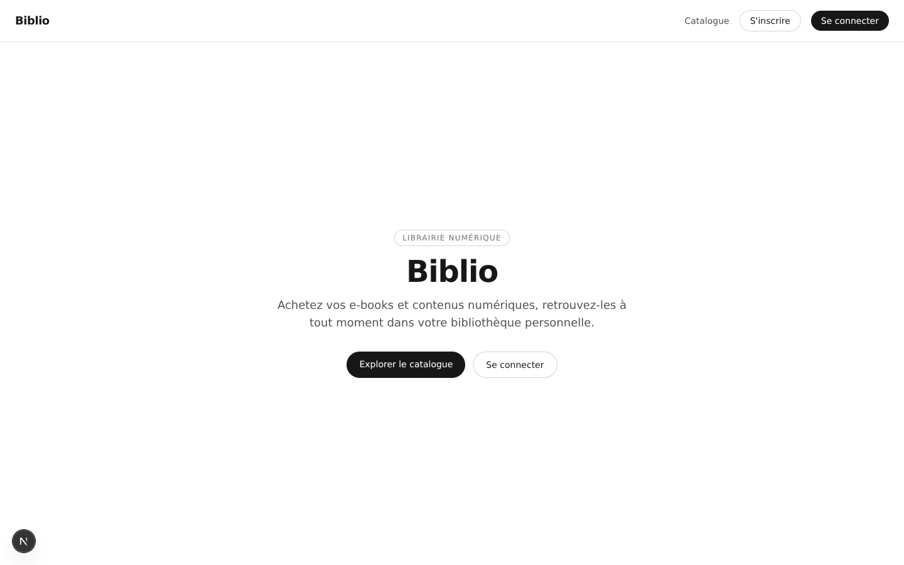
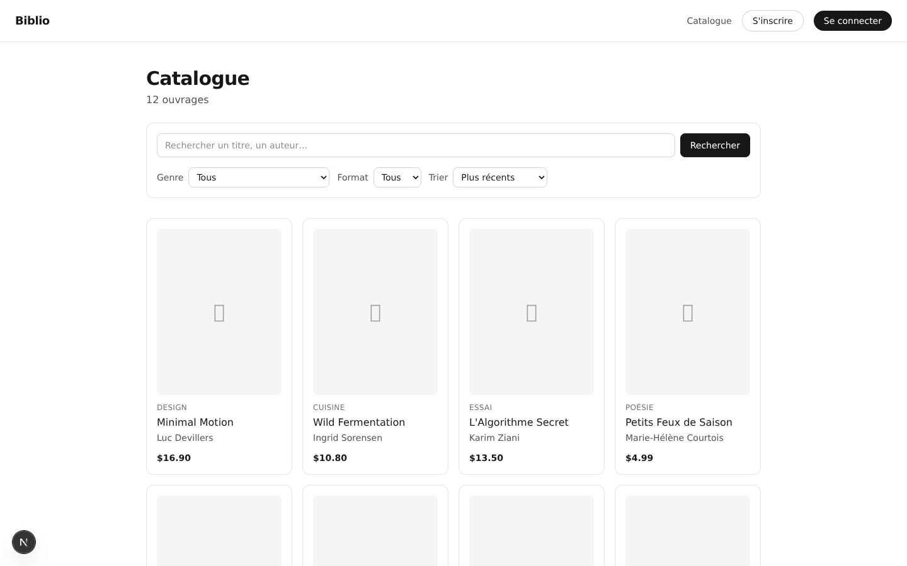
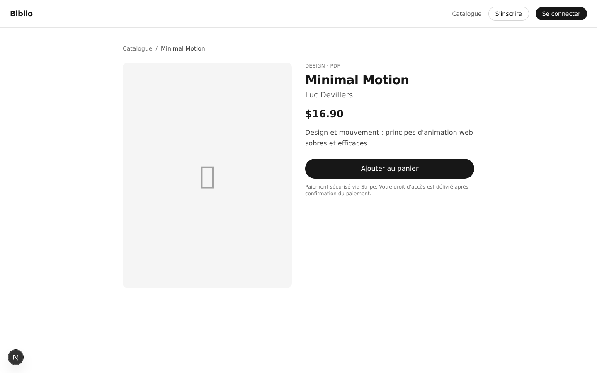
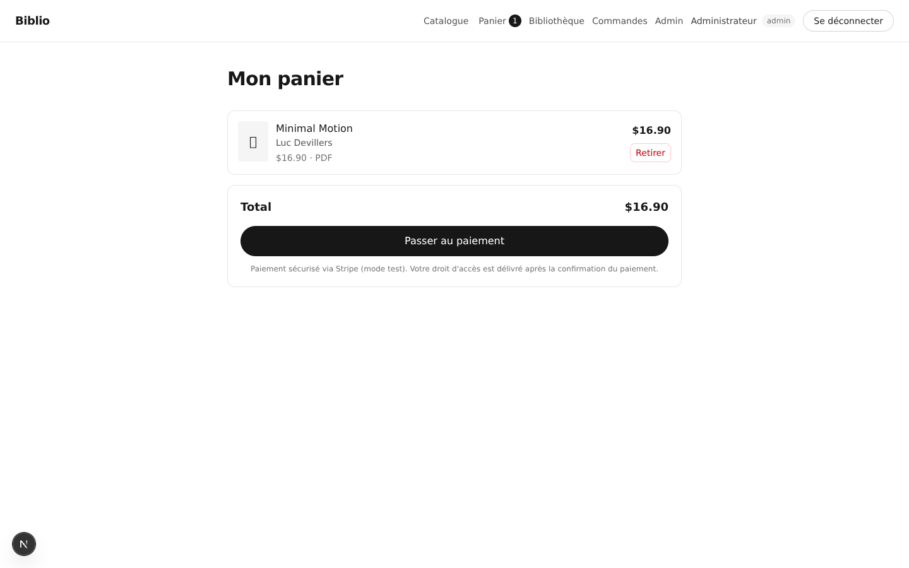
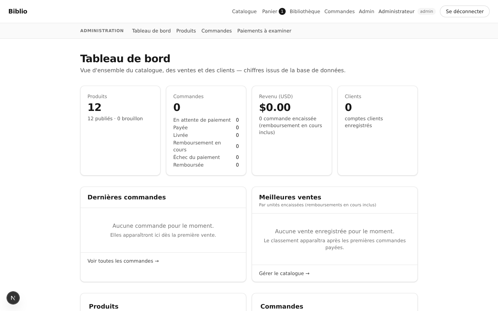
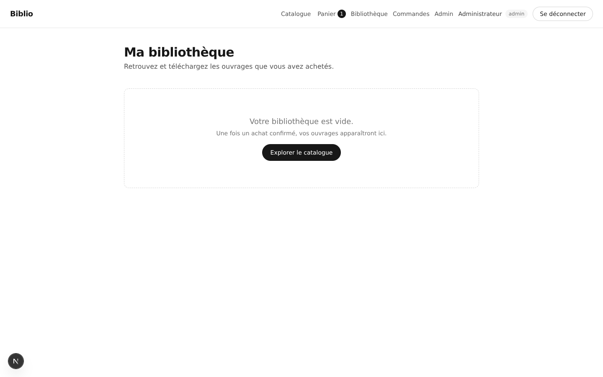

# Biblio

Digital bookshop — ebooks & licences: catalogue, cart, Stripe checkout (test
mode), personal library with presigned downloads, and an admin back office.

**Status:** slices 0–9 done and CI-green; **not yet deployed** — see
[`STATUS.md`](STATUS.md) · work queue: [`docs/fix-plan.md`](docs/fix-plan.md) ·
[open the repository](https://github.com/Youcef16052008/E-Commerce)

## Screenshots

|                                                            |                                                  |
| :--------------------------------------------------------: | :----------------------------------------------: |
|                    |   |
|                           _Home_                           |          _Catalogue (12 seeded titles)_          |
|           |           |
|                       _Product page_                       |       _Cart — Stripe checkout, test mode_        |
|  |  |
|            _Admin dashboard (live DB figures)_             |                _Personal library_                |

## Why this project is interesting

- **Stripe webhook as the single source of truth** — raw-body signature check,
  two-layer idempotency (`Idempotency-Key` + unique `stripe_events`), and the
  event record → `paid` → entitlements → cart clearing committed in **one
  transaction**.
- **Refunds designed for uncertainty** — a durable `refund_pending` reservation
  before calling Stripe, confirmation only via signed webhook, conditional
  revocation (ADR-004). Payment statuses are Stripe's: the admin's only manual
  transition is `paid → fulfilled`.
- **Files never pass through the app** — entitlement check first, then a
  15-minute presigned SigV4 URL. MinIO locally, Cloudflare R2 in production,
  same code, env-only switch (ADR-006).
- **GDPR built in, not bolted on** — JSON data export and self-service
  account deletion (hard delete, or anonymisation when orders must be kept as
  accounting records), a `/legal` page stating the content licence (public
  domain texts, DRM-free personal licence).
- **Real CI** — Postgres 17 service → migrate → seed → unit/integration →
  build → Playwright e2e, on Node 24. `npm run docs:check` fails the build if
  the architecture doc drifts from the filesystem; a coverage floor (70 %) guards
  the checkout and entitlement paths.

## Quickstart

```bash
cp .env.example .env && npm install
npm run db:migrate && npm run seed:all && npm run dev
```

Local demo credentials, storage, imports and the full command table:
[`docs/local-dev.md`](docs/local-dev.md).

## Documentation

| Doc                                                                                           | What                                                                                           |
| --------------------------------------------------------------------------------------------- | ---------------------------------------------------------------------------------------------- |
| [`STATUS.md`](STATUS.md)                                                                      | Single source of truth: slices, validation ledger, versions                                    |
| [`docs/fix-plan.md`](docs/fix-plan.md)                                                        | Audit defects → lots → DoD (what happens next)                                                 |
| [`docs/product.md`](docs/product.md)                                                          | Problem, personas, user stories, scope                                                         |
| [`docs/architecture.md`](docs/architecture.md)                                                | Architecture, ERD, API contracts, folder tree                                                  |
| [`docs/adr/`](docs/adr/)                                                                      | Decision records (framework, DB, auth, payments, deploy, storage, import, refunds, VAT, email) |
| [`docs/deploy-preflight.md`](docs/deploy-preflight.md)                                        | Pre-flight gate + `npm run smoke` before/after each deploy                                     |
| [`docs/runbook-deploy.md`](docs/runbook-deploy.md)                                            | Vercel + Neon + R2 deployment runbook                                                          |
| [`docs/accessibility.md`](docs/accessibility.md) · [`docs/lighthouse.md`](docs/lighthouse.md) | a11y audit · measured scores                                                                   |
| [`docs/local-dev.md`](docs/local-dev.md)                                                      | Local setup, commands, MinIO, Gutenberg import                                                 |

## Stack

Next.js 16.3 · React 19.2 · TypeScript strict · Tailwind 4.3 · PostgreSQL 17
(Neon) · Drizzle 0.45 · Better Auth 1.7 · Stripe Checkout 22.6 (test mode,
locked by code) · Vitest 4 · Playwright 1.62.

## Licence

Code: [MIT](LICENSE). Book content: public-domain works imported from Project
Gutenberg carry their recorded licence per product (ADR-007); demo generated
books are marked as demo files.

Français : [`README.fr.md`](README.fr.md)
