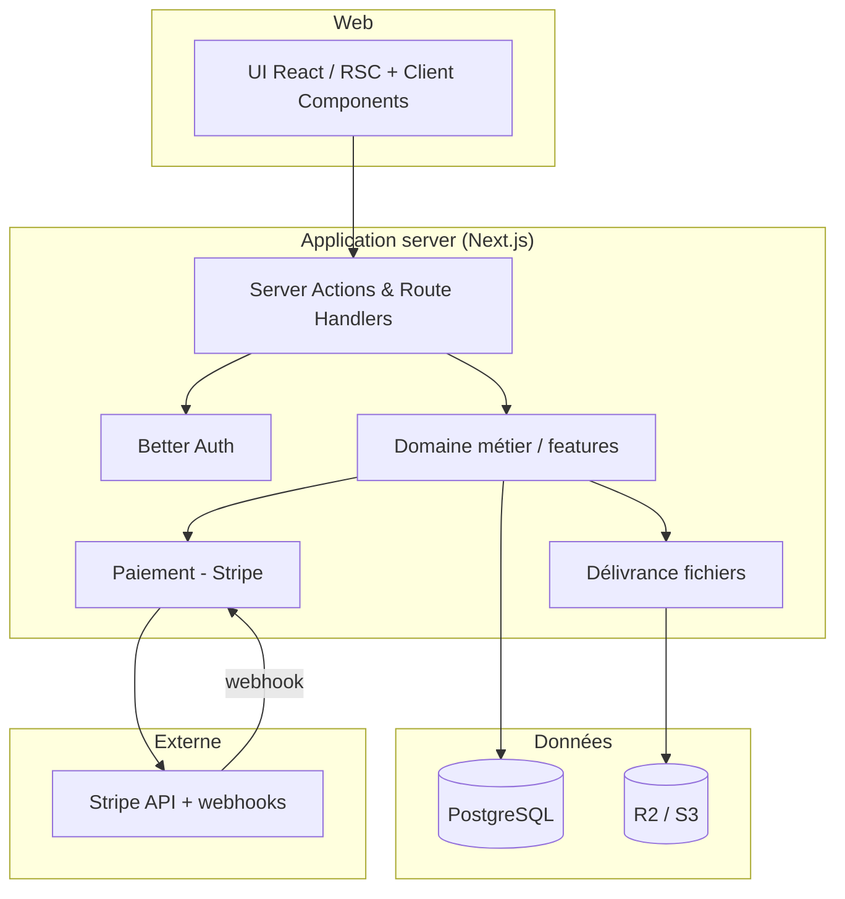

# Architecture — Biblio

## 1. Vue générale

Modular monolith (default). Next.js 16 App Router, server-first. Architecture orientée
**features** (domain / application / infrastructure / ui). La base de données n'est jamais
touchée depuis le client ; toute mutation passe par Server Actions ou Route Handlers
avec validation et autorisation côté serveur.

### Diagramme de contexte (Mermaid)

```mermaid
graph LR
  subgraph Utilisateurs
    V[Visiteur]
    C[Client]
    A[Admin]
  end
  B[Biblio - Next.js 16]
  subgraph Externes
    S[Stripe]
    NE[(Neon Postgres)]
    R2[(R2 / S3 - fichiers)]
    EMAIL[Email (plus tard)]
  end
  V --> B
  C --> B
  A --> B
  B --> S
  S -->|webhooks signés| B
  B --> NE
  B --> R2
  B -.V2.-> EMAIL
```

### Diagramme des conteneurs (Mermaid)



## 2. Responsabilités

- **features/authentication** : Better Auth (email/password), sessions, RBAC.
- **features/products** : catalogue, recherche, filtres, page produit (lecture publique).
- **features/cart** : panier persistant (BDD), ajout/retrait/quantité.
- **features/checkout** : création Stripe Checkout Session, gestion webhooks, idempotence.
- **features/entitlements** : droits d'accès + génération d'URL signées (downloaded links).
- **features/orders** : commandes, historique, statuts (machine à états des transitions).
- **features/admin** : CRUD produits, dashboard, gestion commandes (rôle admin).
- **shared/** : UI, config, types, lib (validation, erreurs typées).
- **server/db** : schéma Drizzle + connexion + migrations.
- **infra/storage** : adaptateur R2/S3 (liens pré-signés).

## 3. Modèle de données (ERD)

```mermaid
erDiagram
  USER ||--o{ ORDER : passe
  USER ||--o{ ENTITLEMENT : possede
  USER ||--o{ CART_ITEM : contenait
  PRODUCT ||--o{ ORDER_ITEM : reference
  PRODUCT ||--o{ CART_ITEM : dans
  ORDER ||--o{ ORDER_ITEM : contient
  ORDER ||--o{ ENTITLEMENT : cree
  PRODUCT ||--o{ ENTITLEMENT : donne
  ORDER ||--o| REFUND : demande
  USER ||--o{ REFUND : demande
  ORDER ||--o{ STRIPE_SYNC_LOG : compare
  STRIPE_EVENT ||--o{ ORDER : traite

  USER { text id PK; text email UK; text name; text passwordHash; text role "customer|admin"; timestamp createdAt }
  PRODUCT { text id PK; text slug UK; text title; text description; text author; text genre; text language; text format "epub|pdf"; text coverUrl; text fileUrl; int priceInCents; boolean published; timestamp createdAt; timestamp updatedAt }
  CART_ITEM { text userId FK; text productId FK; int quantity; pk(userId, productId) }
  ORDER { text id PK; text userId FK; text status "pending|paid|fulfilled|refund_pending|failed|refunded"; int totalInCents; text currency; timestamp createdAt; timestamp paidAt }
  ORDER_ITEM { text orderId FK; text productId FK; text titleSnapshot; int priceInCents; text currency; pk(orderId, productId) }
  ENTITLEMENT { text id PK; text userId FK; text productId FK; text orderId FK; timestamp createdAt; timestamp expiresAt "null" }
  REFUND { text id PK; text orderId UK FK; text requestedByUserId FK; text status "pending|succeeded|failed"; int amountInCents; text currency; text stripeRefundId UK; timestamp createdAt; timestamp completedAt }
  STRIPE_SYNC_LOG { text id PK; text runId; text orderId FK; text stripePaymentIntentId; text status "matched|mismatch|remote_missing|remote_error"; int issueCount; timestamp checkedAt }
  STRIPE_EVENT { text id PK; text stripeEventId UK; text type; timestamp processedAt }
```

> Champs montants toujours en **centimes** (int), jamais en float. Prix toujours relu côté serveur.

## 4. Contrats API

### Public (catalogue)

- `GET /api/products` → liste filtrée (query : `q`, `genre`, `price`, `page`). Validation Zod.
- `GET /api/products/[slug]` → détail.

### Auth (Better Auth)

- Routes gérées par Better Auth (`/api/auth/*`), session httpOnly cookie.

### Panier (session requise)

- `GET /api/cart`, `POST /api/cart` `{ productId, quantity: 1 }`, `PATCH /api/cart/[productId]`, `DELETE /api/cart/[productId]`. Une ligne représente une licence personnelle unique ; les quantités supérieures à 1 et les ouvrages déjà détenus sont refusés.

### Checkout (session requise)

- `POST /api/checkout` → crée ou reprend une intention Stripe Checkout persistée (prix relu serveur, fingerprint déterministe + clé d'idempotence liée à l'ordre). Boutique mono-devises : panier multi-devises → `MIXED_CURRENCY` 400 ; licences déjà détenues ou intention non payable → 409 ; erreur Stripe → 502.
- `POST /api/webhooks/stripe` → corps brut, vérif signature, **traitement avant
  réponse** (500 sur erreur → Stripe réessaie). L'enregistrement de l'événement,
  le passage à `paid`, les entitlements et la suppression des seules lignes de
  panier payées sont atomiques. Les événements async et l'expiration de Checkout
  sont également traités. Les événements `refund.created`, `refund.updated` et
  `refund.failed` sont également vérifiés : seul leur succès confirmé passe la
  commande à `refunded` et révoque l'entitlement, sauf si une autre commande
  encaissée du même client couvre encore le même ouvrage.

### Bibliothèque (session requise)

- `GET /api/me/library` → entités dont l'utilisateur a le droit.
- `POST /api/me/library/[productId]/download` → URL pré-signée (R2/S3) temporaire.

### Admin (session + rôle admin)

- `GET/POST /api/admin/products`, `PATCH/DELETE /api/admin/products/[id]`.
- `GET /api/admin/orders`, `GET /api/admin/stats`.
- `GET /api/admin/payments/exceptions` et `/admin/payments` → file de réconciliation **interne** en lecture seule : références Stripe manquantes, entitlement absent, Checkout expiré et demandes de remboursement non confirmées.
- `npm run stripe:reconcile -- [--order <id>] [--limit 1..100] [--strict]` → seconde réconciliation, bornée et serveur-only, qui lit le Payment Intent et ses refunds Stripe test à partir des identifiants persistés. Elle ne modifie jamais une commande, un remboursement ou un entitlement ; `stripe_sync_log` ne reçoit qu’une trace d’audit non financière.
- `POST /api/admin/orders/[id]/refund` → réserve un remboursement **intégral** (`refund_pending`) puis appelle Stripe avec une clé d'idempotence durable. Réponse `202` = demande en attente, jamais remboursement confirmé. La confirmation Stripe signée est la seule opération qui révoque l'accès lorsqu'aucun autre achat encaissé du client ne couvre le même ouvrage.
- `PATCH /api/admin/orders/[id]/status` → seule la transition opérationnelle
  `paid → fulfilled` est manuelle. Les statuts de paiement, d'échec et de
  remboursement sont réservés aux workflows/webhooks Stripe ; toute tentative
  manuelle reçoit 409 `PAYMENT_STATUS_MANAGED_BY_STRIPE`.

## 5. Authentification & autorisation

- **Better Auth** (email/password), session server-side httpOnly (pas de token dans le client).
- **RBAC** : `role` sur `user`. Middleware = UX (redirection). **La sécurité est re-vérifiée
  dans chaque Server Action / Route Handler** (jamais middleware seul — à la suite de CVE-2025-29927).
- Autorisation objet par objet (ex : bibliothèque filtrée par `userId`).

## 6. Sécurité — stratégie

- **Webhooks Stripe** : corps brut + `stripe.webhooks.constructEvent` (signature).
- **Idempotence 2 couches** : `Idempotency-Key` à la création de session + table `stripe_events`
  avec `stripeEventId UNIQUE` (ON CONFLICT DO NOTHING) côté réception.
- **Remboursement intégral durable** : une seule demande par commande (`refunds.order_id UNIQUE`) est réservée avant l'appel Stripe. La clé d'idempotence Stripe est liée à son UUID. La commande reste `refund_pending` en cas de timeout incertain : elle n'est jamais revenue localement à `paid`, et l'accès n'est jamais révoqué sans événement Stripe signé, montant/devise/Payment Intent/métadonnées vérifiés. Une autre commande encore encaissée pour le même ouvrage conserve l'accès et reçoit le lien d'audit de l'entitlement.
- **Réconciliation distante sans autorité financière** : la commande CLI lit seulement le Payment Intent et au plus 100 refunds liés à son ID persistant ; elle émet un écart si la liste est tronquée. Elle ne crée ni remboursement, ni entitlement, ni changement de statut, et le journal append-only ne conserve que des codes/IDs Stripe.
- Prix toujours relu depuis la BDD, jamais depuis le client.
- Validation **Zod** à toutes les frontières (publiques et privées).
- Erreurs typées ; aucun détail interne exposé (message générique en prod).
- **Headers de sécurité** définis dans `next.config.ts` et figés par test
  (unit + e2e) : `X-Frame-Options: DENY`, `X-Content-Type-Options: nosniff`,
  `Referrer-Policy: no-referrer`, `Strict-Transport-Security` (effectif derrière
  TLS), `Permissions-Policy` (caméra/mic/géo/paiement désactivés),
  `Cross-Origin-Resource-Policy: same-origin`.
- Cookies (Better Auth) : `httpOnly`, `sameSite=lax`, `secure` en production (TLS).
- CSRF : Server Actions de Next (liées aux formulaires + SameSite), pas de token manuel. La route financière de remboursement refuse en plus tout `Origin` navigateur différent de l'origine de la requête.
- Secrets : uniquement côté serveur ; `.env.example` fourni ; `.env*` jamais commité. La fabrique Stripe refuse explicitement les clés `sk_live_`/`rk_live_` : la phase 1 est techniquement limitée au mode test.
- Rate limiting sur auth (plugin Better Auth) et download.

## 7. Cache & fraîcheur des données

- Catalogue : rendu serveur, cache revalidable (ISR) pour les listes publiques.
- Bibliothèque/panier : données propres à l'utilisateur → **pas de cache global partagé**.
- URLs signées : TTL court (ex : 15 min), régénérées à la demande.
- Pas de Redis : aucun besoin d'état distribué au MVP (modular monolith).

## 8. Traitement asynchrone

- Webhook : le traitement est **attendu avant la réponse** (registre H-1) — en
  serverless, un travail laissé tourner après la réponse est tué de façon non
  déterministe. Erreur → 500, Stripe réessaie avec backoff ; idempotence
  (`stripe_events` + fulfillment atomique) rend le retry sans risque. Pas de
  queue au MVP (traitement ≈ quelques dizaines de ms) ; file durable =
  trajectoire post-MVP si le traitement devient lourd.

## 9. Observabilité

- Logs structurés (JSON) sans PII. Suivi des erreurs via un service (Sentry ou équivalent) dès
  la phase déploiement. Métriques de checkout (webhooks reçus/échoués, taux d'entitlement créé).

## 10. Déploiement

- **Vercel** (Next 16) + **Neon** (Postgres 17) + **R2/S3** (fichiers). Secrets via vars d'env Vercel.
- CI GitHub Actions : lint, typecheck, tests, build. Migrations Drizzle versionnées, appliquées en CI/review.
- Rollback : re-déploiement d'une précédente version + migrations réversibles quand possible.

## 11. Structure de dossiers

```
src/
├── app/                      # App Router (routes)
├── features/
│   ├── authentication/       # Better Auth, RBAC
│   ├── products/             # catalogue, recherche
│   ├── cart/                 # panier persistant
│   ├── checkout/             # Stripe, webhooks, idempotence
│   ├── entitlements/         # droits + téléchargements
│   ├── orders/               # commandes
│   └── admin/                # back-office
├── shared/                   # ui, lib, config, types, utils
├── server/
│   ├── db/                   # Drizzle schéma + connexion
│   └── storage/              # adaptateur R2/S3
└── styles/
tests/{unit,integration,e2e}
docs/{architecture,adr,api}
```

## 12. Décisions structurantes

- `docs/adr/001-framework.md` · `002-database.md` · `003-authentication.md`
- `004-payments.md` · `005-deployment.md`
